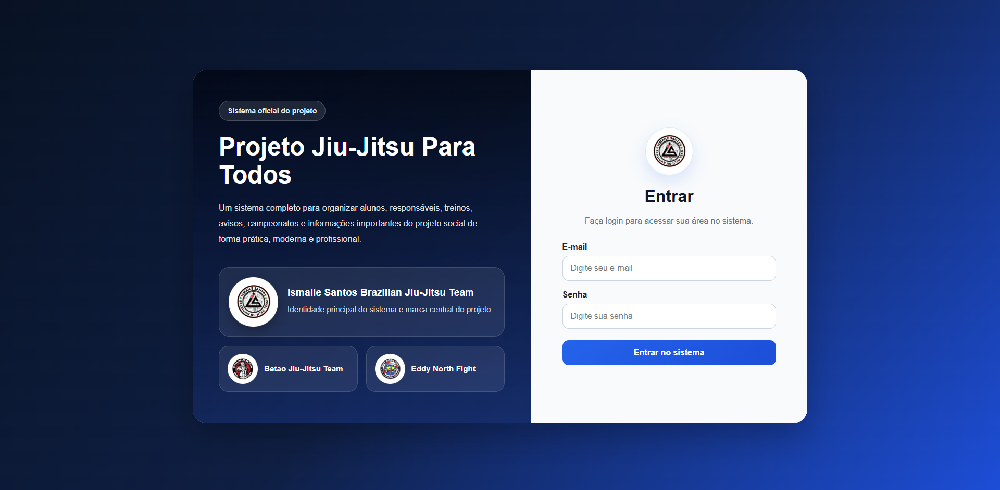
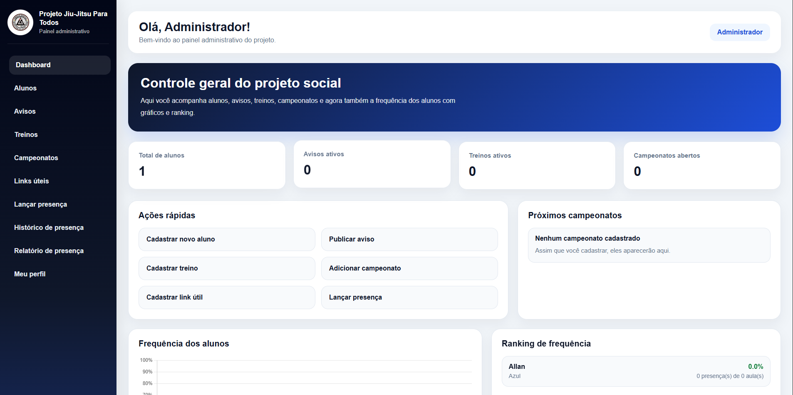
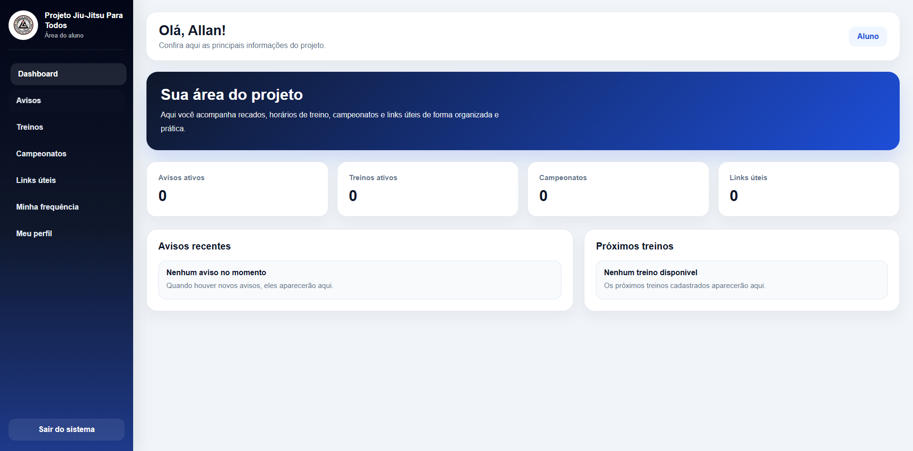
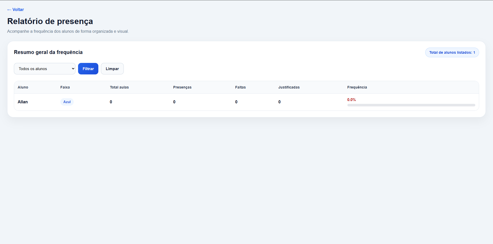

<!-- TYPING EFFECT -->
<p align="center">
  
</p>

---

<h1 align="center">🥋 Sistema de Gestão para Jiu-Jitsu</h1>
<h3 align="center">Projeto Web Completo | PHP + MySQL</h3>

---

## 🚀 Sobre o projeto

💡 Este sistema foi desenvolvido para resolver um problema real:  
o controle manual (em papel) de alunos em um projeto social de jiu-jitsu.

🎯 O objetivo foi criar uma plataforma digital moderna, prática e profissional para gerenciamento completo do projeto.

---

## 🧠 Funcionalidades

### 👨‍💼 Área do Administrador
- Cadastro, edição e exclusão de alunos  
- Upload de foto do aluno  
- Controle de avisos e comunicados  
- Cadastro de treinos  
- Cadastro de campeonatos  
- Cadastro de links úteis  
- Controle de presença  
- Relatório de frequência  
- Dashboard com visão geral  

### 🧑‍🎓 Área do Aluno
- Login individual  
- Visualização de avisos  
- Visualização de treinos  
- Visualização de campeonatos  
- Acesso a links úteis  
- Perfil completo com dados e foto  
- Consulta de presença e frequência  

---

## 🛠️ Tecnologias utilizadas

<p align="center">
  
</p>

---

## ⚙️ Funcionalidades técnicas

- 🔐 Sistema de autenticação (Admin e Aluno)
- 🧾 CRUD completo (Create, Read, Update, Delete)
- 📊 Dashboard dinâmico
- 📷 Upload de imagens
- 📅 Controle de presença
- 📈 Cálculo automático de frequência
- 🎨 Interface moderna e responsiva

---

## 📸 Preview do sistema

<p align="center">
  
</p>

<p align="center">
  
</p>

<p align="center">
  
</p>

<p align="center">
  
</p>

---
<p align="center">
  <a href="https://seusite.infinityfreeapp.com" target="_blank">
    
  </a>
</p>

## 📁 Estrutura do projeto

```bash
admin/
aluno/
assets/
database/
includes/
index.php
login.php
logout.php
